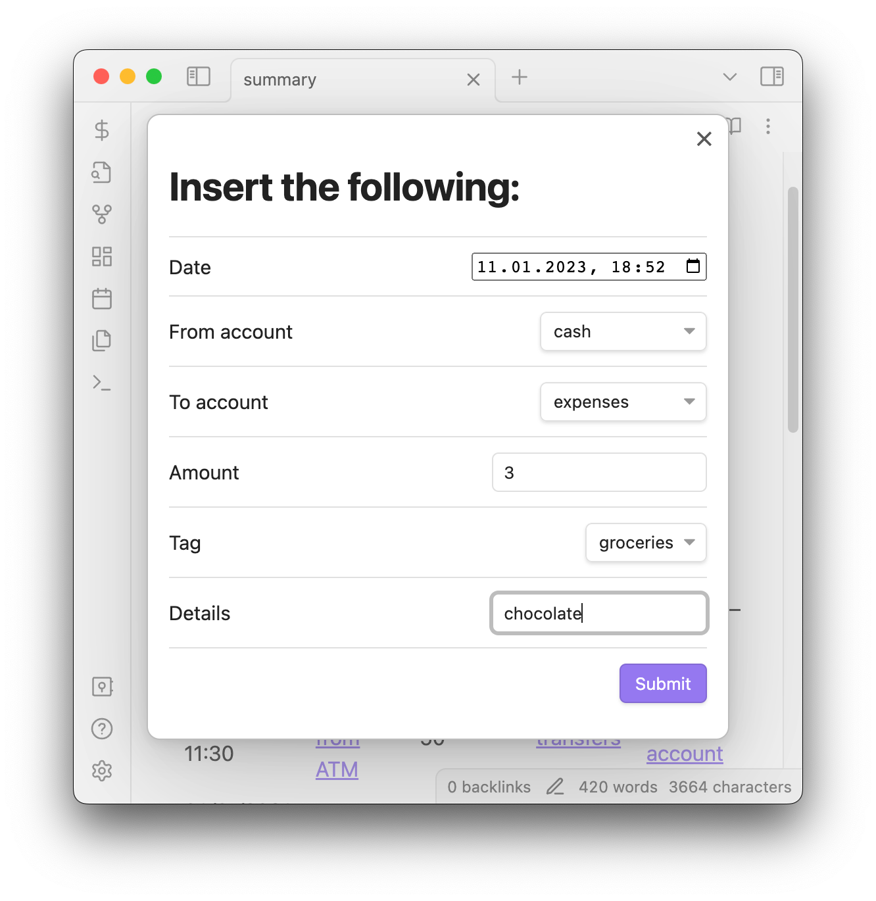
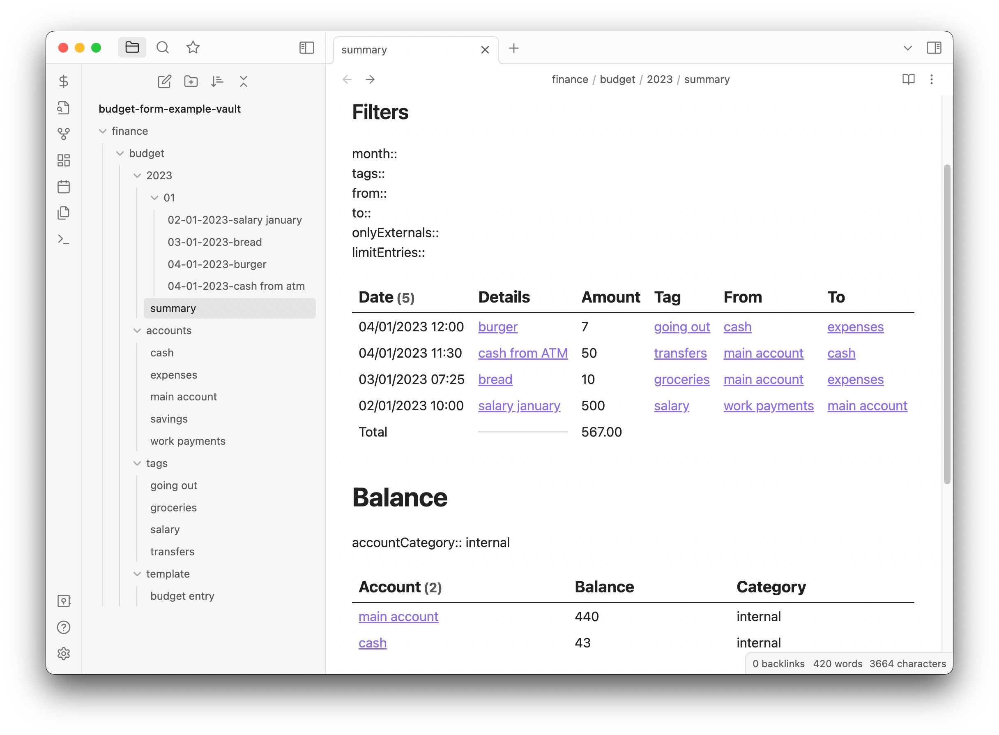
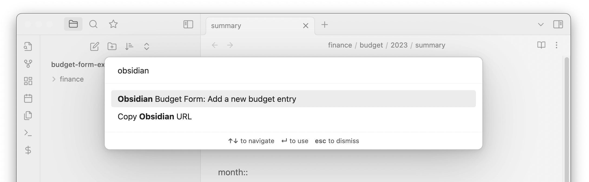
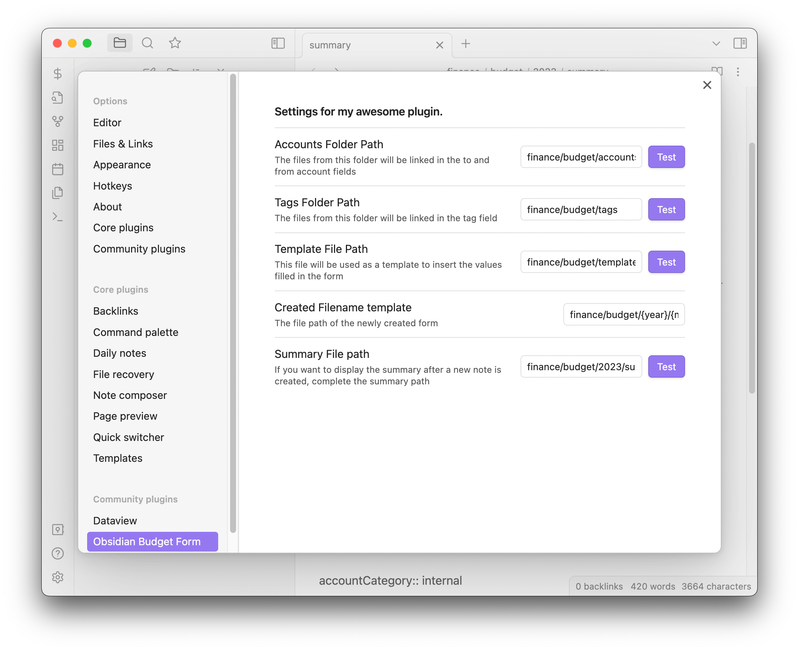

# Obsidian Budget Form

This is a simple, **opinionated** plugin that helps you keep track of your budget and accounts balance. I created this
form because I wanted to keep track of all my expenses and my current balance in Obsidian.

## Example

You can also check the [example vault](./budget-form-example-vault) (download `budget-form-example-vault.zip`
from [the release page](https://github.com/Paul-Gd/obsidian-budget-form/releases)) to try this plugin out.

Using [dataview plugin](https://blacksmithgu.github.io/obsidian-dataview/), all budget entries can be displayed along
with the balance. Some filters can be added in order to reduce the number of entries displayed.




## How to install

Download the latest version (`budget-form-plugin.zip`)
from [the release page](https://github.com/Paul-Gd/obsidian-budget-form/releases) and unzip it in the plugin folder (
usually located at `/path-to-your-vault/.obsidian/plugins`).

## How to use

This plugin adds a new `$` button in the left ribbon and a new command
called `Obsidian Budget Form: Add new budget entry`.


## Structure

The budget is composed of multiple budget entries that are saved as an individual files. Those files are created based
on a template where the fields (`{date}`, `{amount}` etc.) are replaced with the value from the form.

The following fields can be inserted:

-   date
-   from and to account
-   amount
-   tag
-   details

### Accounts

The files from accounts folder will be used in the `From account` and `To account` category. Accounts can have a
category.

Example for [cash "account"](./budget-form-example-vault/finance/budget/accounts/cash.md):

```
category:: internal
```

### Tags

The files from tags folder will be used in the `Tag` category.

Example for [groceries tag](./budget-form-example-vault/finance/budget/tags/groceries.md)

### File template

The template file will be used to create a new entry.

Example of [file template](./budget-form-example-vault/finance/budget/template/budget%20entry.md):

```
date:: {date}
from account:: {fromAccount}
to account:: {toAccount}
amount:: {amount}
tag:: {tag}
details:: {details}
```

After completing the form and tapping on submit, an entry
like [03-01-2023-bread.md](./budget-form-example-vault/finance/budget/2023/01/03-01-2023-bread.md) will be created:

```
date:: 2023-01-03T07:25:00.000Z
from account:: [[finance/budget/accounts/main account.md]]
to account:: [[finance/budget/accounts/expenses.md]]
amount:: 10
tag:: [[finance/budget/tags/groceries.md]]
details:: bread
```

## Plugin settings


The following settings can be changed:

-   Accounts Folder Path - the path from where the `From account` and `To account` fields are populated
-   Tags Folder Path - the path from where the `Tag` field is populated
-   Template File Path - the path where the _**template**_ for the newly created file (budget entry) is located
-   Created Filename template - the path where the newly created file (budget entry) is located
-   Summary File Path - the path where the summary is located. Complete only if you want the summary to open after a new
    entry was inserted

## Summary

The summary is generated by dataview and not included with this plugin. You
can [download it from the example vault](./budget-form-example-vault/finance/budget/2023/summary.md).
