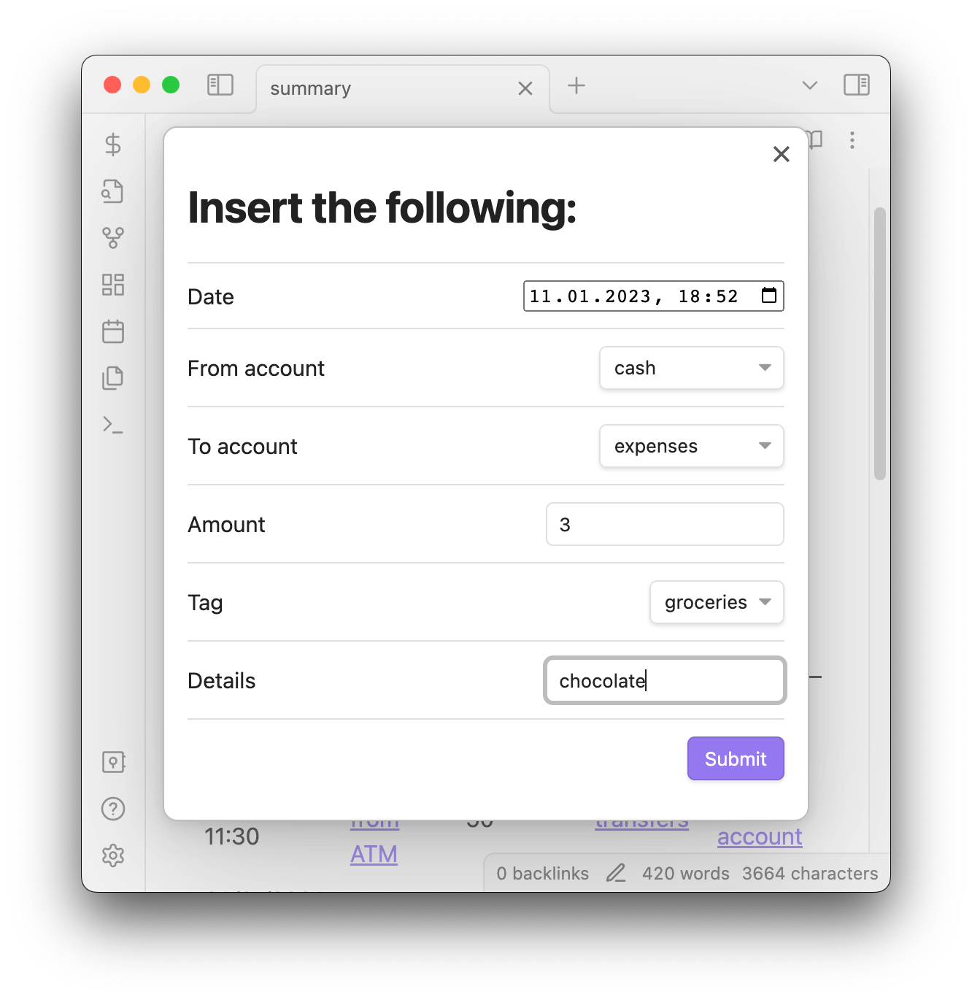
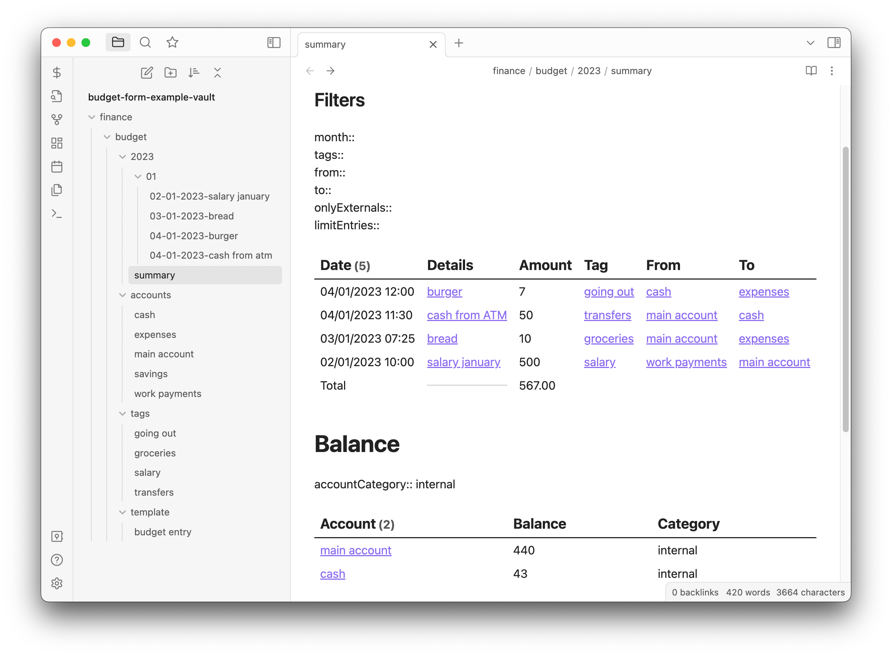
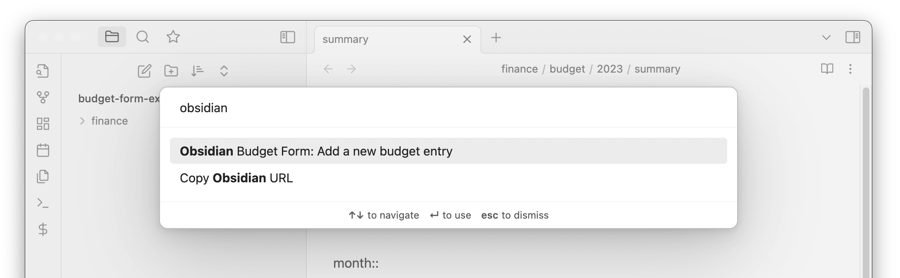
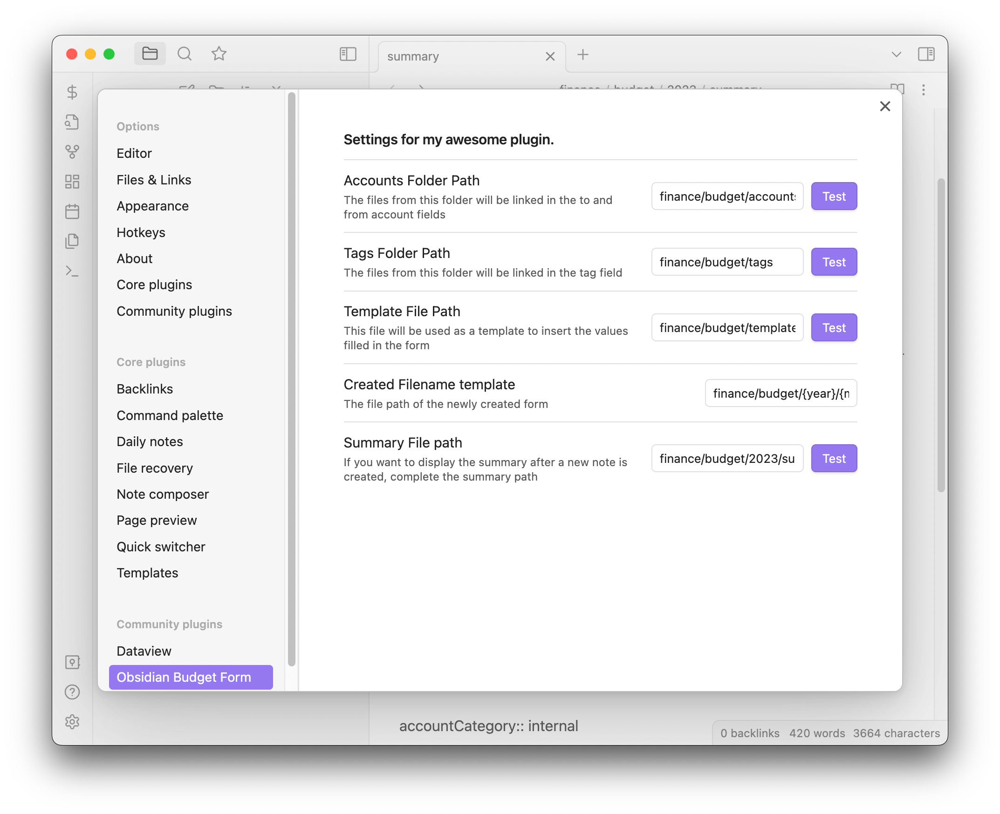

# Obsidian Budget Form

This is a simple, **opinionated** plugin that helps you keep track of your budget and account balances by storing all budget entries in a single JSON file. I created this form because I wanted to efficiently manage all my expenses and current balance in Obsidian without slowing down the application.

## Example

You can also check the [example vault](./budget-form-example-vault) (download `budget-form-example-vault.zip`
from [the release page](https://github.com/Paul-Gd/obsidian-budget-form/releases)) to try this plugin out.

Using the [dataview plugin](https://blacksmithgu.github.io/obsidian-dataview/), all budget entries can be displayed along
with the balance. Some filters can be added in order to reduce the number of entries displayed.




## How to install

Download the latest version (`budget-form-plugin.zip`)
from [the release page](https://github.com/Paul-Gd/obsidian-budget-form/releases) and unzip it in the plugin folder (
usually located at `/path-to-your-vault/.obsidian/plugins`).

## How to use

This plugin adds a new `$` button in the left ribbon and a new command
called `Obsidian Budget Form: Add new budget entry`.


## Structure

All budget entries are now stored in a single JSON file. This approach improves performance by reducing the number of individual files Obsidian needs to manage.

The JSON file contains multiple budget entries with the following fields:

-   date
-   from and to account
-   amount
-   tag
-   details

### Accounts

The files from the accounts folder will be used in the `From account` and `To account` categories. Accounts can have a
category.

Example for [cash "account"](./budget-form-example-vault/finance/budget/accounts/cash.md):

```
category:: internal
```

### Tags

The files from the tags folder will be used in the `Tag` category.

Example for [groceries tag](./budget-form-example-vault/finance/budget/tags/groceries.md)

### JSON File

The budget entries are stored in a single JSON file defined by the plugin settings.

Example of a budget entry in `budgetEntries.json`:

```json
[
  {
    "date": "2023-01-03T07:25:00.000Z",
    "fromAccount": "[[finance/budget/accounts/main account.md]]",
    "toAccount": "[[finance/budget/accounts/expenses.md]]",
    "amount": 10,
    "tag": "[[finance/budget/tags/groceries.md]]",
    "details": "bread"
  }
]
```

## Plugin settings


The following settings can be changed:

-   Accounts Folder Path - the path from where the `From account` and `To account` fields are populated
-   Tags Folder Path - the path from where the `Tag` field is populated
-   Template File Path - the path where the **template** for the newly created entry is located
-   JSON File Path - the path where all budget entries will be stored as a single JSON file
-   Summary File Path - the path where the summary is located. Complete only if you want the summary to open after a new
    entry was inserted

## Obsidian URL

This plugin can handle opening and populating data in the form by using URLs such as [obsidian://budgetForm/openBudgetFormData?amount=10.23&details=something&fromAccount=cash&toAccount=expenses&tag=going%20out](obsidian://budgetForm/openBudgetFormData?amount=10.23&details=something&fromAccount=cash&toAccount=expenses&tag=going%20out)

## Summary

The summary is generated by dataview and not included with this plugin. You
can [download it from the example vault](./budget-form-example-vault/finance/budget/summary.md).
